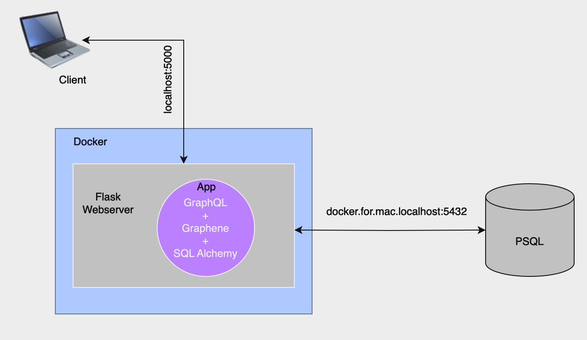

# Recreating Hackernews with GraphQL + Graphene + Flask + SQLAlchemy + Postgres + Docker

Building with a code-first approach using Graphene



## Set up
* Install `postgresql@15` with `brew`
* start `psql` in terminal: `brew services start postgresql@15`
* stop `psql` with `brew services start postgresql@15`
* clone this repo and run `docker-compose up --build` or `docker-compose up`
* access app at [http://127.0.0.1:5000/gql](http://127.0.0.1:5000/gql)

## Adding PSQL DB and tables
* `psql` in terminal
* create a database `create database hackernews`
* `\l` to list databases
* `\c $database_name` to enter a database
* create tables:

```
CREATE TABLE users(
user_id text PRIMARY KEY,
username text,
email text
);
```

```
CREATE TABLE links(
link_id text PRIMARY KEY,
title text,
url text,
upvotes int,
user_id text
);
```


## Add data to tables in Graphiql
* Add users to table:
```
mutation {
  createUser(
    username:"samra",
    email:"samra@mail.com"){
    user{
      username
      email
      userId
      id
    }
  }
}
```
* Get user `id` from `users` table and add links
```
mutation {
  createLink(
    url:"https://www.smithsonianmag.com/smart-news/",
    title:"Smithsonian Magazine",
  	userId: "f6b2581c-f5f8-4595-9d00-699af0cb406b"){
    link{
      url
      upvotes
      linkId
      creator {
        username
      }
    }
  }
}
```
* Upvote some links
```
mutation {
  addUpvote(linkId: "0f9f7bd4-6e2f-4743-ad81-2e0c8371b037") {
    link {
      url
      upvotes
      linkId
      userId
    }
  }
}
```

## Query tables
* query users:

```
query {
  allLinks {
    edges {
      node {
        url
        userId
        upvotes
        creator {
          userId
          username
          email
        }
      }
    }
  } 
}
```
* query links:
```
query {
  allUsers{
    edges {
      node {
        username
        email
        userId
      }
    }
  }
}
```